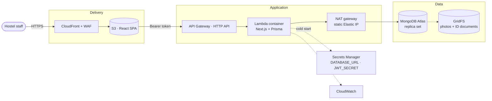

# Hostel Hub — backend

The API and database for Hostel Hub: a hostel management system covering
resident fees, staff salaries and running costs.

Next.js route handlers over MongoDB via Prisma, deployable to AWS Lambda. Every
financial figure the application shows — balances, arrears, profit and loss — is
calculated here and rendered by the SPA in
[Hostel-hub-frontend](https://github.com/Narendra2209/Hostel-hub-frontend).

---

## Architecture



The Lambda sits in a VPC on purpose: it egresses through a NAT gateway with a
**static Elastic IP**, and that single address is the only one allow-listed in
Atlas. Without it, Atlas would have to accept `0.0.0.0/0` and the password would
be the only thing standing between the internet and the register.

Deeper detail — the request layering, the ER diagram, the endpoint inventory and
the authentication sequence — is in [docs/ARCHITECTURE.md](docs/ARCHITECTURE.md).
Deploying it is [docs/DEPLOYMENT.md](docs/DEPLOYMENT.md).

---

## Running it

```bash
npm install
cp .env.example .env

npm run db:up          # MongoDB as a single-node replica set, in Docker
npm run db:push        # create collections and indexes
npm run db:seed        # settings + expense categories only
npm run dev            # http://localhost:4000
```

The app works against a **completely empty database**. There is no seed data it
depends on: add a building, add a resident, and the ledger, arrears and
profit-and-loss screens fill themselves in.

> The replica set is not optional. Every mutation and its audit entry commit in
> one transaction, and MongoDB only offers transactions on a replica set or a
> sharded cluster. A plain `mongod` will fail every write. Atlas is always a
> replica set, so production needs nothing special.

### First run

The first visit to the SPA shows a setup screen that creates the first **OWNER**
account. After that, owners invite colleagues from Settings; each invitee gets a
one-time password and must choose their own on first sign-in.

### Commands

| Command | What it does |
| --- | --- |
| `npm run dev` | Next.js dev server on :4000 |
| `npm run build` | Production build |
| `npm run typecheck` | TypeScript, no emit |
| `npm run lint` | ESLint, zero warnings tolerated |
| `npm test` | Unit tests |
| `npm run test:integration` | Integration tests against a real database |
| `npm run db:push` | Apply schema and indexes (MongoDB has no migrations) |
| `npm run db:seed` | Settings + expense categories |
| `npm run db:studio` | Prisma Studio |
| `npm run import:legacy` | Optional: load a historical register |
| `npm run reset:data` | Delete every business record, keep settings and logins |
| `npm run seed:scale` | Generate a large dataset for load testing |
| `npm run cdk -- deploy --all` | Deploy the AWS stacks |

---

## Environment

`lib/env.ts` is the authoritative list and validates everything at boot.

| Variable | Required | Purpose |
| --- | --- | --- |
| `DATABASE_URL` | yes | MongoDB connection string, including the database name |
| `JWT_SECRET` | yes | Signs session tokens. Min 32 chars (48 in production) |
| `SESSION_TTL_HOURS` | no | Session lifetime, default 12 |
| `FRONTEND_URL` | no | Comma-separated CORS allow-list |
| `MAX_UPLOAD_MB` | no | Largest accepted document, default 15 |
| `RATE_LIMIT_*` | no | In-process limiter tuning |
| `LOGIN_MAX_ATTEMPTS` / `LOGIN_LOCKOUT_MINUTES` | no | Brute-force lockout |
| `LOG_LEVEL` | no | debug / info / warn / error |

Generate a signing key with:

```bash
node -e "console.log(require('crypto').randomBytes(48).toString('base64url'))"
```

Rotating `JWT_SECRET` invalidates every session — that is the emergency
"sign everybody out" lever.

---

## How the money works

**Every amount is stored as an integer number of paise.** ₹4,500.00 is `450000`.

Prisma's MongoDB connector has no decimal type, and storing rupees as a float
would be the exact mistake this codebase exists to avoid: summing a hundred rent
payments would accumulate binary error, and a month could report `PART_PAID`
forever because 4500.55 never quite equals 4500.55. Integers make addition exact
and a zero balance exactly zero. Conversion happens at precisely two boundaries —
see `lib/db/money.ts`.

Other rules, all implemented once in `lib/services/fee-engine.ts`:

- A resident owes their monthly fee for every month from joining through
  vacating, inclusive.
- The due day is clamped to a day that exists — day 31 becomes the 28th or 29th
  in February.
- `balance = max(0, fee − payments allocated to that month)`. Several payments
  may target one month; an overpayment does not roll over.
- A fee is overdue the day **after** its due date, evaluated in Asia/Kolkata.
- Profit and loss is **cash basis**: money received minus money spent.

No balance is ever stored in a field. Everything derives from the ledger, so
nothing can drift out of sync.

---

## Security

- **Passwords** are scrypt hashes (`lib/auth/password.ts`). scrypt rather than
  argon2 or bcrypt because it is built into Node and needs no native module in
  the Lambda image — one less thing to break a deploy.
- **Sessions** are HS256 JWTs carrying only a user id. The role is read from the
  database on every request, so demoting an account takes effect immediately
  rather than whenever its token happens to expire. Revocation works by bumping
  the user's `tokenValidFrom`.
- **Roles**: OWNER, ADMIN, DEVELOPER, MANAGER, VIEWER. DEVELOPER shares ADMIN's
  write rank and adds visibility (activity log, diagnostics) — deliberately it
  cannot change settings or grant roles, because a role that can promote itself
  is a back door.
- **Identity documents** live in GridFS and are never public. Reads stream
  through an authorised route; nothing is ever given a permanent URL.
- **Every mutation is audited** in the same transaction as the change, so the
  trail cannot disagree with the data.
- Account lockout after repeated failures; login refuses to reveal whether an
  email is registered.

---

## Trade-offs of MongoDB

Worth stating plainly, because they are real:

- **No foreign keys.** Guards like "a building with residents cannot be deleted"
  are enforced in the service layer only. There is no database-level backstop.
- **No decimal type.** Hence integer paise, above.
- **Transactions need a replica set.** A standalone `mongod` cannot run this app.
- **Atlas free tier (M0) caps at 500 connections and 512 MB**, which also bounds
  how much can be stored in GridFS. See [docs/PERFORMANCE.md](docs/PERFORMANCE.md)
  for sizing.

---

## Structure

```
app/api/          route handlers, one folder per resource
lib/
  auth/           password hashing, JWT, request context, role guards
  cache/          in-process TTL cache with single-flight loading
  db/             Prisma client, money helpers
  errors/         typed application errors
  http/           route wrapper, responses, CORS, rate limiting, logging
  repositories/   Prisma queries
  services/       business rules, including the fee engine
  storage/        GridFS documents
prisma/           schema and seed
scripts/          import, reset, scale seed, load test, demo accounts
shared/           the API contract (DTOs, Zod schemas) — see below
infrastructure/   AWS CDK stacks
tests/            integration tests
```

Requests flow one way:

```
route handler → Zod validation → auth/authorisation → service → repository → Prisma → MongoDB
```

Financial rules live in services, never in a route.

### `shared/`

The API contract — every DTO and Zod schema. **This copy is the source of
truth**; the frontend repository carries a duplicate and checks it against this
one with `npm run check:shared`. When you change a DTO, change it here first.

---

## Testing

```bash
npm test                    # unit tests, no database needed
npm run test:integration    # against a real MongoDB replica set
```

Integration tests create their own uniquely-prefixed fixtures and delete exactly
those in teardown. They never truncate a collection, so they are safe to run
against a database that holds real records.
