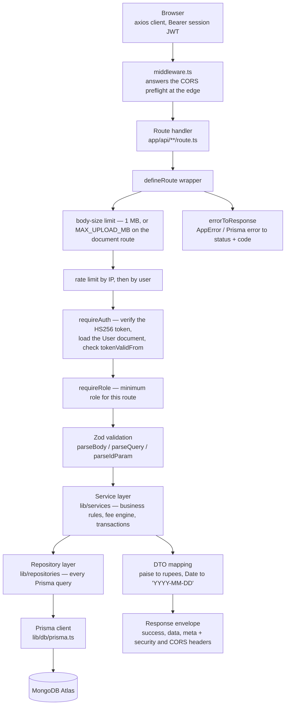
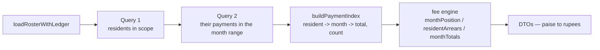
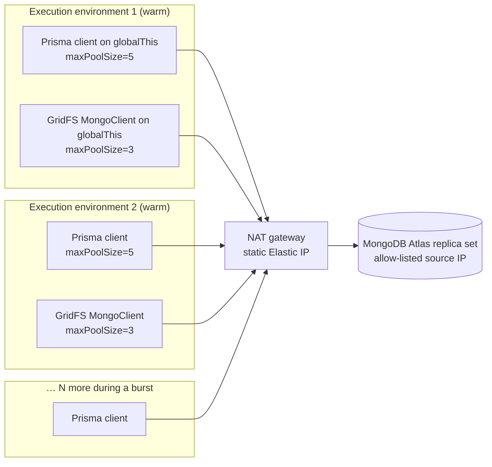
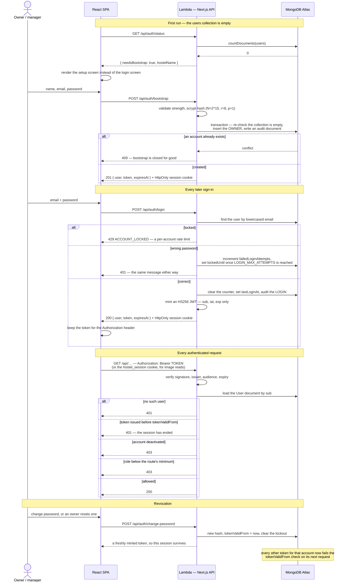

# Architecture

How a request travels, what the database looks like, which endpoints exist, and
the two decisions that keep the system fast on Lambda: no N+1 queries, and a
small, reused connection pool per execution environment.

---

## The request path

Every API route is defined with `defineRoute` (`lib/http/handler.ts`),
which owns the cross-cutting concerns so no individual route repeats them.
Routes stay thin; business rules live in services; database queries live in
repositories.



Rules the layering enforces:

| Layer | May do | Must never do |
| --- | --- | --- |
| `app/api/**/route.ts` | parse input, call one service, shape the response | contain a business rule or a Prisma call |
| `lib/services` | business logic, transactions, audit documents, referential guards, DTO mapping | trust unvalidated input; re-derive a financial rule the fee engine owns |
| `lib/repositories` | Prisma queries, pagination, filters | implement a financial rule |
| `lib/db` | the client singleton, the paise/rupee helpers | know anything about hostels |
| `lib/auth` | hash and verify passwords, mint and verify session tokens, resolve the caller's role | make an authorisation decision a route did not ask for |
| `lib/storage` | GridFS reads, writes and deletes | decide who may see a document |

Three invariants worth stating separately:

- **`lib/services/fee-engine.ts` is the only place a balance, a status or an
  overdue figure is computed.** Repositories load documents; the engine decides
  what they mean; the browser renders the result.
- **Money is integer paise from the field to the DTO boundary.** The conversion
  to rupees happens exactly once, in the mapper (`lib/db/money.ts`).
- **Referential integrity is a service-layer responsibility.** MongoDB has no
  foreign keys, so the guards that used to be `onDelete: Restrict` are now
  explicit checks in `lib/services`. See
  [What MongoDB does not enforce](#what-mongodb-does-not-enforce).

Every response is the same envelope:

```jsonc
{ "success": true,  "data": … , "meta": { "page": 1, "pageSize": 25, "total": 42, "totalPages": 2 } }
{ "success": false, "error": { "code": "VALIDATION_ERROR", "message": "…", "details": { "field": ["…"] } } }
```

---

## The database

MongoDB Atlas is the single source of truth. Every document has an `ObjectId`
`_id`, money is a whole number of **paise**, billing months are a `DateTime`
pinned to the first instant of the month in UTC, and **no derived financial
field exists anywhere** — balances are computed from the ledger, never stored.

There are no migration files: `prisma db push` (`npm run db:push`) applies
`schema.prisma` and creates the indexes declared on each model.

```mermaid
erDiagram
    buildings ||--o{ residents : "houses"
    buildings |o--o{ staff : "employs, null means shared"
    buildings |o--o{ expenses : "billed to, null means shared"
    buildings ||--o{ resident_building_history : "moved to"
    buildings |o--o{ resident_building_history : "moved from"
    residents ||--o{ fee_payments : "settled by"
    residents ||--o{ resident_building_history : "was transferred"
    staff ||--o{ salary_payments : "paid by"
    expense_categories ||--o{ expenses : "classifies"
    users |o--o{ fee_payments : "recorded"
    users |o--o{ salary_payments : "recorded"
    users |o--o{ expenses : "recorded"
    users |o--o{ audit_logs : "acted"

    users {
        ObjectId id PK "_id"
        String name
        String email UK "stored lowercased, so sign-in is case-insensitive"
        String passwordHash "scrypt$N$r$p$salt$key — never leaves the server"
        UserRole role "OWNER ADMIN MANAGER VIEWER, default VIEWER"
        Boolean active "false blocks sign-in and every request"
        Boolean mustChangePassword "set on an invited or reset account"
        DateTime tokenValidFrom "tokens issued before this are rejected"
        Int failedLoginAttempts
        DateTime lockedUntil "nullable, set by the lockout"
        DateTime lastLoginAt "nullable"
        DateTime createdAt
        DateTime updatedAt
    }

    hostel_settings {
        ObjectId id PK "_id"
        Boolean singleton UK "unique constant, a second document is impossible"
        String hostelName
        String currency "symbol, no schema default so the file stays ASCII"
        String currencyCode "INR"
        Int defaultDueDay "5"
        String timezone "Asia/Kolkata"
        DateTime createdAt
        DateTime updatedAt
    }

    buildings {
        ObjectId id PK "_id"
        String name UK
        String code UK "nullable"
        String address "nullable"
        Boolean active
        Int sortOrder
        DateTime createdAt
        DateTime updatedAt
    }

    expense_categories {
        ObjectId id PK "_id"
        String slug UK
        String name UK
        Boolean active
        Int sortOrder "default 500"
        DateTime createdAt
        DateTime updatedAt
    }

    residents {
        ObjectId id PK "_id"
        String name
        String phone "nullable"
        String email "nullable"
        ObjectId buildingId FK "reference only, not enforced"
        Int monthlyFee "PAISE"
        Int dueDay
        DateTime joinDate "first day of the joining month, UTC midnight"
        DateTime vacatedDate "last day of the vacating month, null while staying"
        Boolean active "false means archived, history is retained"
        String notes "nullable"
        ObjectId photoFileId "GridFS file id, nullable, never a URL"
        ObjectId aadhaarFileId "GridFS file id, nullable, never a URL"
        DateTime archivedAt "nullable"
        DateTime createdAt
        DateTime updatedAt
    }

    resident_building_history {
        ObjectId id PK "_id"
        ObjectId residentId FK
        ObjectId fromBuildingId FK "null on the first placement"
        ObjectId toBuildingId FK
        DateTime effectiveDate
        String notes "nullable"
        DateTime createdAt
    }

    fee_payments {
        ObjectId id PK "_id"
        ObjectId residentId FK
        DateTime billingMonth "first instant of the month this settles"
        Int amount "PAISE"
        DateTime paymentDate "when the money actually arrived"
        PaymentMethod paymentMethod "CASH UPI BANK_TRANSFER CARD CHEQUE OTHER"
        String referenceNumber "nullable"
        String note "nullable"
        ObjectId createdById FK "nullable"
        DateTime createdAt
        DateTime updatedAt
    }

    staff {
        ObjectId id PK "_id"
        String name
        String phone "nullable"
        String role "nullable, free text job title"
        ObjectId buildingId FK "null means works across every building"
        Int monthlySalary "PAISE"
        Boolean active
        DateTime joinDate "nullable"
        DateTime endDate "nullable"
        String notes "nullable"
        DateTime archivedAt "nullable"
        DateTime createdAt
        DateTime updatedAt
    }

    salary_payments {
        ObjectId id PK "_id"
        ObjectId staffId FK
        DateTime salaryMonth "first instant of the salary month"
        Int amount "PAISE"
        DateTime paymentDate
        PaymentMethod paymentMethod
        String note "nullable"
        ObjectId createdById FK "nullable"
        DateTime createdAt
        DateTime updatedAt
    }

    expenses {
        ObjectId id PK "_id"
        DateTime date
        ObjectId buildingId FK "null means an unattributed shared cost"
        ObjectId categoryId FK
        Int amount "PAISE"
        String vendor "nullable"
        String referenceNumber "nullable"
        String note "nullable"
        ObjectId createdById FK "nullable"
        DateTime createdAt
        DateTime updatedAt
    }

    audit_logs {
        ObjectId id PK "_id"
        ObjectId userId FK "null for system or import actions"
        AuditAction action "CREATE UPDATE DELETE ARCHIVE RESTORE MOVE LOGIN"
        AuditEntityType entityType "RESIDENT BUILDING FEE_PAYMENT STAFF SALARY_PAYMENT EXPENSE EXPENSE_CATEGORY SETTINGS USER SESSION"
        String entityId
        String summary "nullable"
        Json oldData "nullable"
        Json newData "nullable"
        DateTime createdAt
    }
```



### What MongoDB does not enforce

Every `FK` in that diagram is an **ObjectId stored in a field**, and nothing
below the application checks it. Prisma models the relation so `include` works
and so the generated types are correct, but there is no constraint in the
database: no `RESTRICT`, no `CASCADE`, no `SET NULL`. Deleting a building out
from under its residents would leave dangling `buildingId` values, and MongoDB
would accept it without complaint.

The rules that used to be schema-level are therefore **application-level only**,
and each one lives in a service:

| Rule | Where it now lives |
| --- | --- |
| A building with residents, staff, bills or move history cannot be deleted | `building.service.ts` |
| A resident with payments is archived (`active = false`), never removed | `resident.service.ts` |
| A staff member with salary payments is archived, never removed | `staff.service.ts` |
| A category still used by an expense is deactivated rather than deleted | `expense.service.ts` |
| Removing a user must not orphan the transactions they recorded, and must not leave the hostel with no active owner | `user.service.ts` |

This is a real loss. Under PostgreSQL those guards held no matter which code
path — or which person at a `psql` prompt — attempted the write. Now a service
that forgets its check, or a direct `mongosh` session, can leave an orphaned
reference behind and nothing will stop it. Any new endpoint that deletes or
re-parents a document must add the guard itself; that is a code-review
responsibility, not a schema guarantee.

Two invariants survive at the database level, because MongoDB can express them
as unique indexes: `hostel_settings.singleton` (a second configuration document
is impossible even under a race between two cold Lambdas) and `users.email`
(which is also what makes sign-in case-insensitive, since the address is stored
lowercased).

Indexes are declared on the models and created by `prisma db push`: compound
`(buildingId, active)` and `(residentId, billingMonth)` for the roster and
ledger reads, `(entityType, entityId)` and `createdAt` on the audit trail, and
single-field indexes on the columns the list screens filter and sort by.

---

## API endpoints

All paths are relative to `/api`. "Role" is the **minimum** role required;
`OWNER` › `ADMIN` › `MANAGER` › `VIEWER`, and a route with no role stated
defaults to VIEWER. "Weight" is what the endpoint charges against
`RATE_LIMIT_MAX_REQUESTS`; unlisted means 1. Every listed route also exports
`OPTIONS` for the CORS preflight, and every one of them is `runtime = 'nodejs'`,
`dynamic = 'force-dynamic'` — nothing is cached or prerendered.

### Authentication

These five are new. There is no identity provider: the application issues its
own sessions.

| Method | Path | Role | Weight | Purpose |
| --- | --- | --- | --- | --- |
| GET | `/auth/status` | anonymous | 1 | `{ needsBootstrap, hostelName }`. The one thing the login screen needs before anybody has signed in. Read-only, so it answers correctly against a completely empty cluster. |
| POST | `/auth/bootstrap` | anonymous | 5 | Creates the first OWNER on a fresh deployment and signs them in (201). The service re-checks inside the transaction that the users collection is empty and answers 409 once any account exists, so this endpoint stops working for good the moment it is used. |
| POST | `/auth/login` | anonymous | 5 | Email + password for a session. Applies the per-account lockout. |
| POST | `/auth/logout` | anonymous | 1 | Clears the session cookie. Anonymous on purpose — signing out must work when the token has already expired. Nothing is deleted server-side; the token stays valid until it expires. |
| POST | `/auth/change-password` | VIEWER | 5 | Any signed-in account changes its own password — including an invited one that still carries `mustChangePassword` and can do nothing else. Bumps `tokenValidFrom`, so every *other* session ends, and returns a fresh token so the caller stays where they are. |

### Session and configuration

| Method | Path | Role | Purpose |
| --- | --- | --- | --- |
| GET | `/health` | anonymous | Reports MongoDB reachability (`$runCommandRaw { ping: 1 }`) and answers 503 when it is unreachable. |
| GET | `/me` | VIEWER | The signed-in account and the permission flags the UI uses to decide which buttons to render. Costs no extra query — `defineRoute` has already resolved it. |
| GET | `/settings` | VIEWER | Hostel name, currency, default due day, timezone. Bootstrapped on first read. |
| PATCH | `/settings` | OWNER | Edit the same. |

### Buildings and expense categories

| Method | Path | Role | Purpose |
| --- | --- | --- | --- |
| GET | `/buildings` | VIEWER | Every building with its dependent-document counts, in two queries. |
| POST | `/buildings` | ADMIN | Add a building. |
| GET | `/buildings/[id]` | VIEWER | One building with its counts. |
| PATCH | `/buildings/[id]` | ADMIN | Rename, recode, reorder. |
| DELETE | `/buildings/[id]` | OWNER | Refused while any resident, staff member, bill or move-history document still points at it. **This check is the only thing preventing an orphan** — there is no foreign key behind it. |
| GET | `/expense-categories` | VIEWER | The categories bills are filed against; the eight defaults are created idempotently on first read. `?includeInactive=true` shows retired ones. |
| POST | `/expense-categories` | ADMIN | Add a category. |
| PATCH | `/expense-categories/[id]` | ADMIN | Rename, reorder, activate or deactivate. |
| DELETE | `/expense-categories/[id]` | OWNER | Deletes only when unused; otherwise deactivates and says so in the response. |

### Residents

| Method | Path | Role | Purpose |
| --- | --- | --- | --- |
| GET | `/residents` | VIEWER | One page of the roster, already priced for the selected month, plus list meta (month, staying count, total on record). |
| POST | `/residents` | ADMIN | Add a resident. |
| GET | `/residents/[id]` | VIEWER | One resident. |
| PATCH | `/residents/[id]` | ADMIN | Edit. |
| DELETE | `/residents/[id]` | OWNER | Archive or delete, depending on whether financial history exists. |
| GET | `/residents/[id]/profile` | VIEWER | Everything the profile page renders in one call: the resident, lifetime totals, this month's position, arrears, month-by-month history, payments and transfers. |
| GET | `/residents/[id]/payments` | VIEWER | That resident's payment history, paginated. |
| GET | `/residents/[id]/fee-status?year=` | VIEWER | The Jan–Dec strip for one resident. |
| GET | `/residents/fee-status?year=` | VIEWER | Jan–Dec strips for many residents in **two** queries — this is what keeps the dashboard to one request. Filters: `buildingId`, `residentIds`, `limit`. |
| POST | `/residents/[id]/move` | ADMIN | Transfer to another building; the move and its history document are written in one transaction. |
| POST | `/residents/[id]/vacate` | ADMIN | Record a departure. The vacating month is billed in full. |

### Resident documents

`/residents/[id]/documents/[kind]`, where `kind` is `photo` or `aadhaar`. This
one route replaced the whole S3 presign / confirm / signed-URL dance — the files
live in GridFS in the same cluster, so there is no third party to hand temporary
credentials to.

| Method | Role | Weight | Purpose |
| --- | --- | --- | --- |
| POST | ADMIN | 5 | `multipart/form-data` upload. The declared size is checked *before* the body is buffered, so an oversized file never materialises in Lambda's memory; type and size are validated against `MAX_UPLOAD_MB` (8 MB for photos) and the stored name is server-generated. The new file id is saved on the resident inside a transaction, and only then is the previous file deleted. |
| GET | VIEWER | 1 | Streams the stored bytes back with the recorded content type. Authorises from the `Authorization` header **or** the `hostel_session` cookie, because an `` tag can send neither a header nor anything else; on the cross-origin production layout the SPA fetches it with the bearer token and renders a blob URL instead. |
| DELETE | ADMIN | 1 | Clears the reference on the resident, then removes the GridFS file. A failed delete is logged rather than thrown — an orphaned file is housekeeping, whereas failing the request would leave the database pointing at a document the user believes they removed. |

There is no `/uploads/presigned-url` and no `/uploads/confirm`. Those endpoints
are gone.

### Fees, payments and arrears

| Method | Path | Role | Purpose |
| --- | --- | --- | --- |
| GET | `/fees` | VIEWER | The monthly fee ledger: one month, every enrolled resident, with expected / paid / balance / status from the fee engine. |
| GET | `/overdue` | VIEWER | Every unpaid month past its due date, `groupBy=month` or `groupBy=resident`; the stat cards read `meta.totals`. |
| GET | `/payments` | VIEWER | The payment ledger, filtered and paginated. |
| POST | `/payments` | MANAGER | Record a payment. |
| GET | `/payments/[id]` | VIEWER | One payment. |
| PATCH | `/payments/[id]` | ADMIN | Correct a recorded transaction. |
| DELETE | `/payments/[id]` | ADMIN | Reverse one. |
| POST | `/payments/settle` | MANAGER | "Mark paid" / "Full". The client sends only who and which month; the amount is the balance the fee engine derives **inside the writing transaction**, so a stale screen cannot over- or under-pay. |

### Staff and salaries

| Method | Path | Role | Purpose |
| --- | --- | --- | --- |
| GET | `/staff` | VIEWER | The salary register for a month. |
| POST | `/staff` | ADMIN | Add a staff member. |
| PATCH | `/staff/[id]` | ADMIN | Edit, or set `active: false` to mark somebody as having left. |
| DELETE | `/staff/[id]` | OWNER | Remove from the register: archived when salary payments exist, deleted when none do. |
| GET | `/salaries` | VIEWER | Salary payments, filtered and paginated. |
| POST | `/salaries` | MANAGER | Record a salary payment. |
| PATCH | `/salaries/[id]` | ADMIN | Correct one. |
| DELETE | `/salaries/[id]` | ADMIN | Reverse one. |
| POST | `/salaries/settle` | MANAGER | Pay the remaining `monthlySalary − already paid`, computed in the same transaction that writes it. |

### Expenses

| Method | Path | Role | Purpose |
| --- | --- | --- | --- |
| GET | `/expenses` | VIEWER | The bills register. `meta` carries totals for the whole filtered set, not just the page on screen. |
| POST | `/expenses` | MANAGER | Record a bill. |
| PATCH | `/expenses/[id]` | ADMIN | Edit one. |
| DELETE | `/expenses/[id]` | ADMIN | Delete one — an expense is a leaf, nothing references it. |

### Reporting, export and administration

| Method | Path | Role | Weight | Purpose |
| --- | --- | --- | --- | --- |
| GET | `/dashboard` | VIEWER | 2 | Everything the Overview screen renders, in one response. |
| GET | `/reports/pnl` | VIEWER | 3 | The cash-basis Profit & loss statement plus the year-to-date strip. |
| GET | `/export/residents` | ADMIN | 5 | The resident register as CSV (default) or JSON. |
| GET | `/export/payments` | ADMIN | 5 | The fee ledger as CSV or JSON; `month` selects the billing month, `from`/`to` when the money arrived. |
| GET | `/export/expenses` | ADMIN | 5 | The running-cost register as CSV or JSON; shared bills export as "Shared". |
| GET | `/audit-logs` | ADMIN | 1 | Who changed what, when. Documents are written in the same transaction as the change they describe. |
| GET | `/users` | ADMIN | 1 | The account list, most-privileged first. The rows never carry a password hash — the service selects an explicit field list. |
| POST | `/users` | OWNER | 5 | Invite a colleague (201). The response contains a **one-time temporary password**: it is not stored in plaintext, not audited and not recoverable, and the account is created with `mustChangePassword`. |
| PATCH | `/users/[id]` | OWNER | 1 | Rename, change role, activate or deactivate. Refused if it would leave the hostel with no active owner. |
| POST | `/users/[id]/reset-password` | OWNER | 5 | The "I have forgotten mine" path — there is no email delivery in this deployment. Returns a new password once, forces a change on next sign-in, and bumps `tokenValidFrom` so every session that account holds ends immediately. An empty body means "generate one for me". |

---

## Avoiding N+1 queries

The naive version of this application issues one query per resident per month —
a 200-resident hostel with three years of history would make tens of thousands of
round trips to paint one screen. Every read path here instead goes through
`loadRosterWithLedger` (`lib/services/roster.service.ts`), which is always
**two** queries:

1. the residents in scope (filtered by `active` and `buildingId`, ordered by
   name);
2. every fee payment belonging to *those* residents within the month range the
   caller needs — `residentId in […]` and `billingMonth` between the bounds,
   selecting only `residentId`, `billingMonth`, `amount`.

Those payment documents are then folded, in memory, into a
`Map<residentId, Map<'YYYY-MM', { total, count }>>` by `buildPaymentIndex`, and
the fee engine walks that index. The range is chosen by the caller:

| `range` | Payments loaded | Used by |
| --- | --- | --- |
| `'month'` | just the month in view | the fee ledger |
| `'history'` (default) | from the earliest joining month to the month in view | overdue, dashboard arrears |
| `'year'` | one calendar year | the Jan–Dec fee strips |



The cost is `O(residents × months)` of in-memory **integer** arithmetic over
documents that were already fetched — a few thousand of them for a real hostel.
Moving from `Prisma.Decimal` to integer paise made this cheaper as well as
exact: the inner loop is now plain number addition rather than arbitrary-
precision objects.

The result is that even the heaviest endpoints are a small constant number of
queries:

- `GET /api/dashboard` — settings, roster + ledger (2), buildings, staff,
  salaries grouped by staff, expenses grouped by category and building,
  categories, and the fee-strip year ledger. About eleven, whatever the size of
  the hostel.
- `GET /api/reports/pnl` — roughly seven, including one grouped scan of the
  year's fee payments. There is no per-month and no per-building query anywhere
  in the file.

No repository or service may issue a query inside a `for` loop over residents,
staff or months. That is the rule the two-query loader exists to make easy.

---

## Lambda, Prisma and MongoDB connections

There is no RDS Proxy here and no equivalent to put in front of Atlas. The
MongoDB driver pools internally, so the whole strategy is: **one client per
execution environment, and keep its pool small.**



The moving parts, and why each is the way it is:

- **One client per execution environment.** The Prisma client is cached on
  `globalThis`, so a warm container pays for the SRV lookup and TLS handshake to
  Atlas once and reuses the pool for the life of the container. Without that,
  every invocation would rebuild a pool, and a burst would exhaust the cluster's
  connection limit.
- **Created lazily, on first use.** `lib/db/prisma.ts` exports a `Proxy` that
  builds the real client on the first property access. `next build` imports every
  route module to collect page data; an eager client would demand a
  `DATABASE_URL` at build time, and a cold start that only serves `/api/health`
  would pay to construct a client it never queries. The document route builds its
  handler lazily for the same reason — `MAX_UPLOAD_MB` must not be needed at
  build time.
- **`maxPoolSize=5`, and it is deliberately small.** `buildDatasourceUrl()`
  appends it — along with `retryWrites=true`, `w=majority` and
  `serverSelectionTimeoutMS=10000` — to whatever the connection string already
  says, and never overrides a parameter an operator set explicitly. A Lambda
  serves **one request at a time**, so anything above a couple of sockets is
  mostly idle; and the number that matters to Atlas is *pool size × number of
  warm containers*, which is the figure that exhausts a cluster during a burst.
  Atlas shared tiers cap total connections in the low hundreds, so five per
  container is the difference between surviving a spike and being refused.
- **GridFS keeps its own, smaller pool.** Prisma has no GridFS support, so
  `lib/storage/gridfs.ts` opens a native `MongoClient` at `maxPoolSize: 3`,
  cached on `globalThis` — including the *in-flight* connect promise, so two
  concurrent uploads on a cold start do not each open a pool. A rejected connect
  is not cached, so the next attempt retries. Document traffic is rare compared
  with normal reads, which is why three is enough; the ceiling per warm container
  is therefore eight sockets, and only when both clients are in use.
- **Transactions need the replica set.** `runInTransaction` wraps `$transaction`
  with a 5 s max wait and a 15 s timeout (MongoDB aborts server-side at 60 s
  regardless). MongoDB offers snapshot isolation only, so unlike the PostgreSQL
  version there is no isolation level to choose. Repositories accept a
  `PrismaLike` handle so they compose inside one. A standalone `mongod` rejects
  every one of these — see the README's MongoDB trade-offs.
- **No migrations, and no second connection string.** `prisma db push` applies
  the schema and its indexes; there is no `directUrl`, no shadow database and no
  `DIRECT_DATABASE_URL`.
- **The network is the second credential.** The Lambda runs in private subnets
  behind a NAT gateway with a static Elastic IP, and Atlas Network Access allows
  only that address. A leaked connection string used from anywhere else does not
  connect. The cost is the NAT gateway itself and the fact that the API is now
  tied to a VPC.
- **Neither secret is an environment variable.** `lambda-bootstrap.mjs` fetches
  one Secrets Manager secret at cold start — over a VPC interface endpoint, so
  the call never leaves the VPC — reads `DATABASE_URL` and `JWT_SECRET` from it,
  and only then starts the Next standalone server. It refuses to start, with a
  message that names the missing key and never prints its value, if either is
  absent.
- **Health checks are cheap.** MongoDB has no `SELECT 1`;
  `checkDatabaseConnection()` issues `$runCommandRaw({ ping: 1 })`, which needs
  no collection to exist and works against an entirely empty cluster.

---

## Authentication and authorisation

The token proves *who* the caller is. The User document decides *what they may
do* — the role is never read from a claim the browser could shape, because the
token does not carry one.



Details that are easy to get wrong and are deliberate here:

- **The token carries no role.** Only `sub`, `iat` and `exp`, plus a checked
  issuer (`hostel-manager`) and audience (`hostel-manager-web`). Roles change,
  and a token minted an hour ago must not keep OWNER access after an owner
  demoted the account, so `requireAuth` loads the User document on every request
  and reads the role from there. It costs one indexed lookup and buys immediate
  revocation.
- **`tokenValidFrom` is the revocation mechanism.** There is no server-side
  session store — there is nowhere to keep one on Lambda — so every token issued
  before that instant is rejected. A one-second slack absorbs the fact that
  `iat` has second precision while `tokenValidFrom` is a millisecond timestamp;
  without it, the token minted by a password change could be rejected by the
  very change that minted it.
- **Signing out is client-side.** `POST /api/auth/logout` clears the cookie and
  the SPA drops its copy, but the token itself remains valid until it expires.
  Ending sessions for real means a password reset or a deactivation, both of
  which bump `tokenValidFrom`.
- **Two transports, one token.** The API sets an HttpOnly, SameSite=Lax,
  Secure-in-production cookie *and* returns the token. The cookie cannot travel
  to an API on a different domain, which is exactly the production layout
  (CloudFront + API Gateway), so the SPA also sends `Authorization: Bearer`.
  The cookie is what lets the document endpoint authorise a plain `` on
  a same-site deployment. `extractToken` prefers the header and falls back to
  the cookie.
- **Lockout is per account, not per IP.** An IP-keyed lockout is trivially
  bypassed with a handful of addresses and easy to weaponise against a shared
  office connection. Per account, it does mean somebody can lock a colleague out
  by guessing at their address — a deliberate trade, bounded by the 15-minute
  window and undone instantly by an owner-issued reset.
- **No API Gateway JWT authorizer.** The application verifies tokens itself, in
  one place, because it has to load the User document anyway — and because a
  gateway authorizer rejects CORS preflights, which never carry an
  `Authorization` header. Edge protection is WAF plus API Gateway throttling.
- **There is no dev bypass.** `AUTH_DEV_BYPASS` and its companions are gone
  entirely. Local development signs in through the same first-run bootstrap as
  production, against the same code path.
- **The client trusts nothing it decodes.** `the frontend repository/auth/AuthProvider.tsx`
  takes the identity, the role and the permission flags from `GET /api/me`,
  never from parsing the token.
